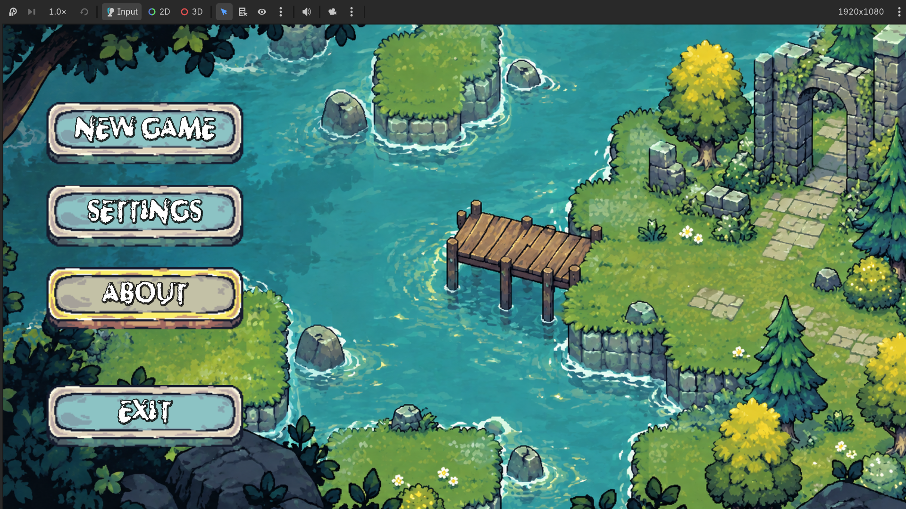
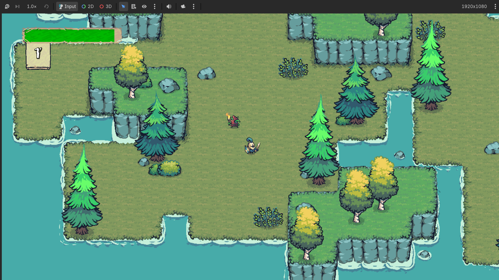
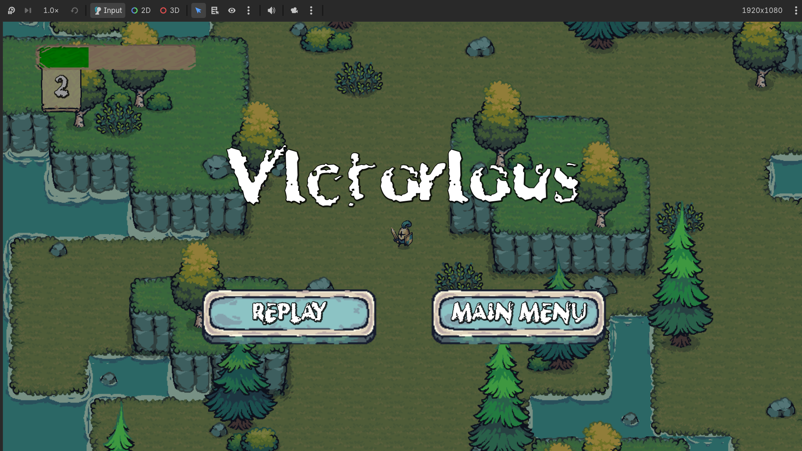

# Tales of Everwood

A colorful top-down RPG adventure developed using Godot and GDScript.

## 🎮 About

Tales of Everwood is a top-down fantasy adventure where the player controls a knight exploring the world, fighting enemies, gaining experience, and becoming stronger.

The current version is a playable prototype, with plans to expand it into a larger story-driven RPG with multiple maps and areas.

## ✨ Features

- 🗡️ Top-down player combat
- 👾 Enemy AI with chasing and attacking
- ❤️ Player health system
- ⚔️ Direction-based attacks
- ⭐ XP and level-up system
- ⚡ Attack speed increases with progression
- 🏆 Victory condition
- 💀 Game-over system
- 🔄 Replay level functionality
- 🏠 Main menu
- 🎨 Pixel-art fantasy environment

## 🛠️ Built With

- **Godot Engine**
- **GDScript**

## 🎨 Assets & Credits

The game uses assets from **Tiny Swords** by Pixel Frog.

- Asset Pack: [Tiny Swords](https://pixelfrog-assets.itch.io/tiny-swords)
- Creator: **Pixel Frog**
- Platform: itch.io

All credit for the original Tiny Swords assets goes to Pixel Frog.

## 🎯 Current Version

**v1.0 – Playable Prototype**

The current version contains a single playable area with enemies, combat, XP progression, victory, and game-over systems.

## 📸 Screenshots

### Main Menu

### Gameplay

### Victory

## 🎮 Controls

| Action | Control |
|---|---|
| Move | WASD |
| Attack | Left Mouse Button |

## 🚀 Future Plans

- Multiple story-driven maps
- New enemies and bosses
- More weapons and abilities
- NPCs and dialogue
- Quests
- Story progression
- Expanded world exploration
- More levels and environments

## 👨‍💻 Developer

**H N Adith**

Built as a personal game development project while learning and experimenting with Godot.

---

⭐ More features and maps will be added as development continues.
